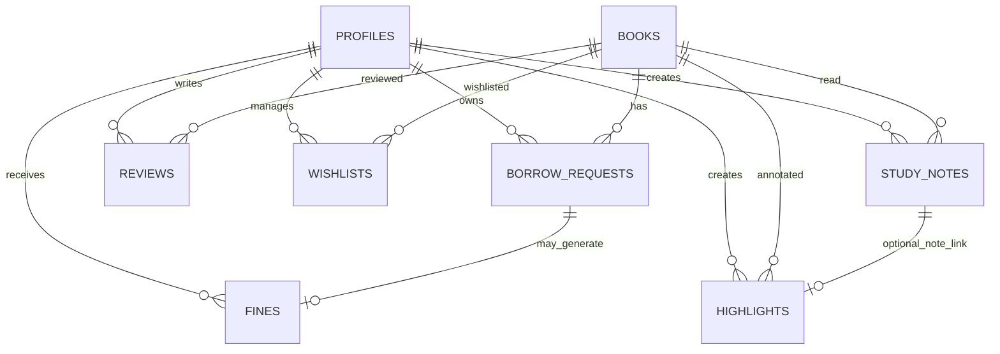

# Smart Lib schema and app model

This document captures the Supabase database schema and app flow actually used by the project.

## 1. Core auth and role model

### `public.profiles`
Used for role-aware auth routing and student/admin access.

| Field | Type | Notes |
| --- | --- | --- |
| `id` | `uuid` | Supabase auth user id |
| `email` | `text` | Login email |
| `role` | `text` | `student` or `admin` |
| `full_name` | `text` | Optional display name |
| `created_at` | `timestamptz` | Default timestamp |

Typical app behavior:
- `/dashboard` checks `profiles.role`
- `admin` redirects to `/dashboard/admin`
- `student` redirects to `/dashboard/student`
- login and sign-up upsert into `profiles` if missing

## 2. Library catalog and lending flow

### `public.books`
Main catalog table.

| Field | Type | Notes |
| --- | --- | --- |
| `id` | `bigint` | Primary key |
| `title` | `text` | Book title |
| `author` | `text` | Author name |
| `category` | `text` or enum | App uses category labels like fiction, science, etc. |
| `isbn` | `text` | Optional |
| `description` | `text` | Summary |
| `total_copies` | `int` | Total available copies |
| `available_copies` | `int` | Copies currently available |
| `pdf_url` | `text` | PDF file URL for e-reader |
| `created_at` | `timestamptz` | Insertion time |
| `search_vector` | `tsvector` | Full-text index used by `search_books()` |

Notes:
- Admins create books from the admin dashboard.
- Student dashboard queries books and shows `available_copies`.
- `pdf_url` is used by `/reader/[bookId]`.
- `search_vector` is used for the recommendation / full-text search flow.

### `public.borrow_requests`
Represents a student borrowing request.

| Field | Type | Notes |
| --- | --- | --- |
| `id` | `bigint` | Primary key |
| `student_id` | `uuid` | References `profiles.id` |
| `book_id` | `bigint` | References `books.id` |
| `status` | `text` | `pending`, `approved`, `rejected`, `returned` |
| `request_date` | `timestamptz` | Created when student requests |
| `due_date` | `timestamptz` | Set when admin approves |
| `returned_date` | `timestamptz` | Set when returned |
| `notes` | `text` | Optional admin or student notes |

Behavior:
- Student requests borrow via insert into `borrow_requests`.
- Admin approves or rejects from admin dashboard.
- On approval, due date is set to 14 days ahead.
- On approval, `books.available_copies` is decremented.

## 3. Student features

### `public.reviews`
One review per student per book.

| Field | Type | Notes |
| --- | --- | --- |
| `id` | `bigint` | Primary key |
| `book_id` | `bigint` | Book reviewed |
| `student_id` | `uuid` | Reviewer |
| `rating` | `int` | 1 to 5 |
| `comment` | `text` | Review text |
| `created_at` | `timestamptz` | Posted at |
| `UNIQUE(book_id, student_id)` | constraint | Prevents duplicate review |

### `public.wishlists`
Wishlist entries for students.

| Field | Type | Notes |
| --- | --- | --- |
| `id` | `bigint` | Primary key |
| `book_id` | `bigint` | Book wishlisted |
| `student_id` | `uuid` | Student owner |
| `created_at` | `timestamptz` | When saved |
| `UNIQUE(book_id, student_id)` | constraint | Prevents duplicates |

## 4. Fines and notifications

### `public.fines`
Tracks overdue fees.

| Field | Type | Notes |
| --- | --- | --- |
| `id` | `bigint` | Primary key |
| `borrow_request_id` | `bigint` | Borrow record |
| `student_id` | `uuid` | Student charged |
| `amount` | `numeric(10,2)` | Fine total |
| `status` | `text` | `unpaid` or `paid` |
| `created_at` | `timestamptz` | Record created |
| `paid_at` | `timestamptz` | Optional payment timestamp |

### `public.email_queue`
Background async notifications queue.

| Field | Type | Notes |
| --- | --- | --- |
| `id` | `bigint` | Primary key |
| `event_type` | `text` | e.g. `borrow_request_status` |
| `payload` | `jsonb` | Event data |
| `processed` | `bool` | Queue state |
| `created_at` | `timestamptz` | Insert time |
| `processed_at` | `timestamptz` | Completion time |

This is meant to be consumed by a worker or Edge Function.

## 5. E-Study Room / PDF reader

### `public.study_notes`
Student-created study notes attached to a book + page.

| Field | Type | Notes |
| --- | --- | --- |
| `id` | `bigint` | Primary key |
| `user_id` | `uuid` | Auth user |
| `book_id` | `bigint` | Book being studied |
| `page` | `int` | PDF page number |
| `text` | `text` | Main note content |
| `selection_text` | `text` | Captured text selection |
| `meta` | `jsonb` | Extra detail (future use) |
| `created_at` | `timestamptz` | Insert time |
| `updated_at` | `timestamptz` | Last update |

### `public.highlights`
Page highlight regions for reader overlays.

| Field | Type | Notes |
| --- | --- | --- |
| `id` | `bigint` | Primary key |
| `user_id` | `uuid` | Auth user |
| `book_id` | `bigint` | Book |
| `page` | `int` | PDF page |
| `rects` | `jsonb` | Highlight coordinates |
| `color` | `text` | Highlight color |
| `note_id` | `bigint` | Optional note link |
| `meta` | `jsonb` | Extra metadata |
| `created_at` | `timestamptz` | Insert time |

## 6. Search model

### `public.search_books(p_query, p_limit)`
This SQL function uses `tsvector` and full-text search for ranked results.

Behavior:
- Builds `search_vector` from title + description + category
- Uses `plainto_tsquery('english', ...)`
- Orders by `ts_rank()`
- Returns ranked book results to the app recommendation API

## 7. Relationship map

## 8. Recommended improvements

1. Add index coverage for fast queries:
   - `borrow_requests(student_id, status)`
   - `borrow_requests(book_id, status)`
   - `profiles(email)` unique index
   - `books(category)` index
   - `study_notes(user_id, book_id, page)`

2. Add a `books` validation rule:
   - `available_copies <= total_copies`
   - trigger or check constraint

3. Add `updated_at` triggers for `books`, `borrow_requests`, and `fines` for easier auditing.

4. Add Storage bucket policy for PDFs:
   - `pdfs` or `library-files` bucket
   - signed URLs for private files

5. Add a proper role guard in middleware or server routes to prevent client-only loopholes.

6. Add a proper admin/staff UI for `fines`, `reviews`, and the study room notes pane.

7. Optionally split the logic into:
   - auth/profile service
   - borrowing service
   - notes/highlights service
   - notifications queue worker

## 9. Working app-level flow

1. User signs in via Supabase auth.
2. `/dashboard` resolves role from `profiles`.
3. Student sees catalog, requests, borrowed books, notes, and recommendations.
4. Admin sees metrics, add-book form, requests, and approval actions.
5. Book PDF is displayed in the E-Study Room.
6. Highlighted quotes and notes are saved to `study_notes` / `highlights`.
7. Borrow event triggers notification queue and later fines processing.

## 10. Migration files used

- `supabase/migrations/20260810_add_reader_reviews_wishlist_notifications_fines.sql`
- `supabase/migrations/20260811_add_fulltext_search_books.sql`
- `supabase/migrations/20260812_add_study_notes_highlights.sql`
